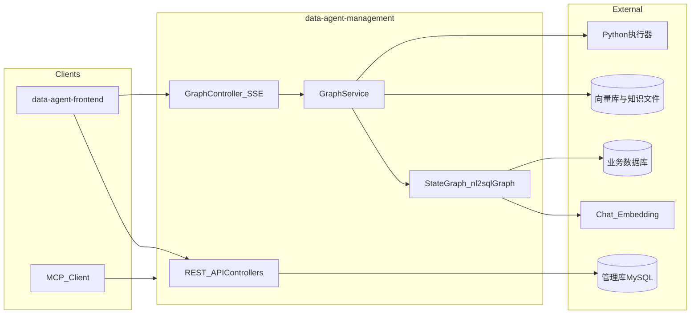
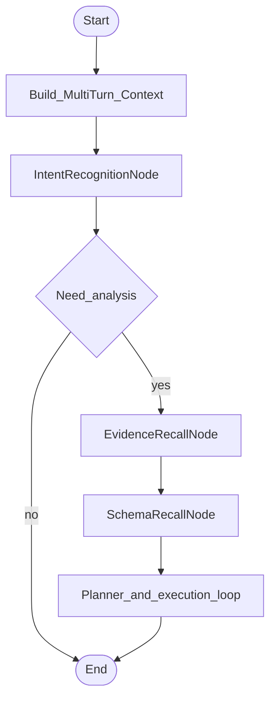

# DataAgent 上手与 AI Agent 学习指南

本文面向刚接手 **Spring AI Alibaba DataAgent** 的开发者：用一页纸说清项目在做什么、总体架构、Agent 运行时数据流，并给出可执行的 **学习思路** 与 **分阶段学习计划**。学完后若要做 **同类产品规划**，见独立文档 [产品蓝图 PRODUCT_BLUEPRINT.md](./PRODUCT_BLUEPRINT.md)。详细设计请以官方 [架构设计](./ARCHITECTURE.md) 为准。

---

## 1. 项目一页纸概览

### 1.1 是什么

**DataAgent** 是基于 **Spring AI Alibaba Graph**（`StateGraph`）构建的**企业级智能数据分析 Agent**。它不只做 Text-to-SQL，还串联 **Python 深度分析**、**多步骤规划**、**（可选）人工审核计划**、**RAG 检索增强**，并输出带 **ECharts** 的 HTML/Markdown 报告。系统兼容 **OpenAI 风格**的对话与 Embedding 接口，可对接多种向量库与主流大模型。

### 1.2 仓库模块与技术栈

| 部分 | 路径 | 说明 |
|------|------|------|
| Maven 父工程 | [pom.xml](../pom.xml) | 聚合子模块，统一版本（Spring Boot 3.4.x、Spring AI Alibaba 1.1.x 等） |
| 后端（唯一 Maven 子模块） | [data-agent-management/](../data-agent-management/) | Spring Boot + MyBatis + Spring AI + MCP Server（WebFlux）+ Reactor SSE |
| 前端（独立工程） | [data-agent-frontend/](../data-agent-frontend/) | Vue 3 + Vite + Element Plus + ECharts，通过 REST/SSE 调后端 |

**后端技术要点**：Java 17+；`com.alibaba.cloud.ai.graph.StateGraph` 编排工作流；图编译时可配置 **interrupt**（例如在人工反馈节点前暂停，见下文 `GraphServiceImpl`）；多种业务库 JDBC；向量检索与混合检索策略；Python 代码在 Docker 或本地进程中执行。

### 1.3 核心能力清单（与 README 对齐）

- **智能数据分析**：多表、多轮意图 + StateGraph 节点流水线
- **Python 分析**：生成并执行 Python（统计/预测等）
- **报告**：汇总为 HTML/Markdown + 图表
- **Human-in-the-loop**：计划阶段可介入、否决后重回 Planner
- **RAG**：业务元数据、术语等入向量库，辅助 SQL 质量
- **多模型**：模型注册表，运行时切换 Chat/Embedding
- **MCP**：可作为 MCP 服务器对外暴露能力（如 NL2SQL）
- **API Key**：调用与权限管理（见进阶文档）

---

## 2. 总体架构图

与 [docs/ARCHITECTURE.md](./ARCHITECTURE.md) 中的分层一致，以下为便于记忆的精简视图（不含官方图中的全部 Bean 名称）。

**更完整的组件与类名映射**（含 Langfuse、HybridRetrieval、CodePool 等）请直接阅读：[架构设计 - 总体架构图](./ARCHITECTURE.md)。

---

## 3. Agent 运行时数据流（从 SSE 到 StateGraph）

### 3.1 用户对话的入口

前端通过 **SSE（Server-Sent Events）** 订阅分析过程。入口类：

- [**GraphController.java**](../data-agent-management/src/main/java/com/alibaba/cloud/ai/dataagent/controller/GraphController.java)：`/api/stream/search` 构建 `GraphRequest`，调用 `GraphService.graphStreamProcess`，将图执行过程中的事件推送给客户端。

### 3.2 服务层：编译图、流式上下文、多轮与人机协同

- [**GraphServiceImpl.java**](../data-agent-management/src/main/java/com/alibaba/cloud/ai/dataagent/service/graph/GraphServiceImpl.java)  
  - 构造时将 `StateGraph` **compile** 为 `CompiledGraph`，并配置 `interruptBefore(HUMAN_FEEDBACK_NODE)`，支持在人工反馈点前暂停与恢复。  
  - `graphStreamProcess`：维护 `threadId` 与 `StreamContext`，区分新请求与带 `humanFeedbackContent` 的续跑。  
  - 同步入口 `nl2sql` 可走简化路径（仅 NL2SQL）。

### 3.3 图在哪里定义

- [**DataAgentConfiguration.java**](../data-agent-management/src/main/java/com/alibaba/cloud/ai/dataagent/config/DataAgentConfiguration.java)：`nl2sqlGraph` Bean 中注册各 **Node** 与 **Dispatcher**（条件边），将 START/END 与常量节点名连接成完整 DAG/状态机。

### 3.4 节点与分支

- **节点实现目录**：[workflow/node/](../data-agent-management/src/main/java/com/alibaba/cloud/ai/dataagent/workflow/node/)  
  示例：`IntentRecognitionNode`、`EvidenceRecallNode`、`SchemaRecallNode`、`TableRelationNode`、`FeasibilityAssessmentNode`、`PlannerNode`、`PlanExecutorNode`、`HumanFeedbackNode`、`SqlGenerateNode`、`SemanticConsistencyNode`、`SqlExecuteNode`、`PythonGenerateNode`、`PythonExecuteNode`、`PythonAnalyzeNode`、`ReportGeneratorNode` 等。
- **路由/条件边**：[workflow/dispatcher/](../data-agent-management/src/main/java/com/alibaba/cloud/ai/dataagent/workflow/dispatcher/)  
  与 `StateGraph.END` 及各节点名配合，实现重试、跳过、结束等逻辑。

### 3.5 与官方流程图对照

官方文档中的 **运行时主流程**（意图 → 检索增强 → Schema → 表关系 → 可行性 → 计划 → 人工门 → SQL/Python/报告）见：[ARCHITECTURE.md - 运行时主流程](./ARCHITECTURE.md)。阅读代码时建议 **打开该 Mermaid 图**，每经过一个节点在 IDE 中单步对照 `workflow/node` 对应类。

（完整分支与循环以 [ARCHITECTURE.md](./ARCHITECTURE.md) 大图为准。）

---

## 4. 目录与包职责速查

| 包/目录（`data-agent-management` 下） | 职责 |
|--------------------------------------|------|
| `controller/` | REST、SSE、管理端接口 |
| `service/graph/` | 图执行、多轮上下文、与流式 Sink 交互 |
| `config/` | `StateGraph` Bean、模型/向量库/工具等 Spring 配置 |
| `workflow/node/` | 各 **Agent 步骤** 的业务与 LLM 调用 |
| `workflow/dispatcher/` | 图上的 **条件跳转** |
| `service/vectorstore/`、`service/hybrid/` | RAG、向量与混合检索 |
| `service/code/` | Python 执行器（Docker/Local 等） |
| `service/mcp/` | MCP 服务封装，内部仍可使用 `GraphService` |
| `mapper/`、`entity/` | MyBatis 与管理库数据 |

前端 [data-agent-frontend/src](../data-agent-frontend/src) 侧重点：对话 UI、流式展示、管理配置页面（与 `/api` 约定）。

---

## 5. AI Agent 开发学习思路（如何读这个项目）

1. **建立概念映射**  
   把 Spring AI Alibaba Graph 里的 **State / Node / Edge / CompiledGraph / interrupt** 与本仓库的 `OverAllState`、`workflow/node`、`dispatcher`、`GraphServiceImpl` 编译选项对应起来。你在变的是「状态」和「下一步去哪个节点」，而不是单一 prompt 流水线。

2. **先跑通，再断点**  
   按 [快速开始](./QUICK_START.md) 导入 [schema.sql](../data-agent-management/src/main/resources/sql/schema.sql)、启动后端与前端，走通一次完整问答。然后对 `GraphController.streamSearch` → `GraphServiceImpl` → 某一个 `*Node` 打断点，观察状态 Map 里有哪些 key（可与 `constant.Constant` 对照）。

3. **按「数据契约」读节点**  
   每个节点通常：读全局 state → 调 LLM 或工具 → 写回 state。重点问自己：「上一步留下了什么？本步产出什么？失败时 dispatcher 回到哪里？」

4. **对照官方架构文档做校验**  
   分支、重试环（如 SQL 语义校验不通过回到 `SqlGenerateNode`）在 [ARCHITECTURE.md](./ARCHITECTURE.md) 里已画清；代码里用 `dispatcher` 实现，避免只靠搜字符串猜流程。

5. **扩展学习路径**  
   - RAG：从 `AgentVectorStoreService`、hybrid 策略读起。  
   - 工具化/MCP：读 `McpServerService` 与 Spring AI MCP 相关配置。  
   - 可观测性：`LangfuseService` 与文档中的观测说明。

---

## 6. 分阶段学习计划

以下为 **6 个阶段**（可按周推进，也可按主题压缩）；每阶段含 **必读文档**、**源码锚点**、**实践任务**、**自检问题**。

### Phase 0：环境与第一印象（约 0.5～1 天）

| 项 | 内容 |
|----|------|
| 必读 | [QUICK_START.md](./QUICK_START.md)、根目录 [README.md](../README.md) |
| 实践 | 导入管理库 schema；启动 `data-agent-management` 与 `data-agent-frontend`；创建 Agent、连接数据源、发起一次分析 |
| 自检 | SSE 事件大致顺序是什么？`threadId` 何时生成？ |

### Phase 1：请求链路与会话状态（约 2～3 天）

| 项 | 内容 |
|----|------|
| 必读 | [ARCHITECTURE.md](./ARCHITECTURE.md) 中「总体架构图」「运行时主流程」 |
| 源码 | [GraphController.java](../data-agent-management/src/main/java/com/alibaba/cloud/ai/dataagent/controller/GraphController.java)、[GraphServiceImpl.java](../data-agent-management/src/main/java/com/alibaba/cloud/ai/dataagent/service/graph/GraphServiceImpl.java)、`service/graph/Context/` 下多轮与流式上下文 |
| 实践 | 在 `graphStreamProcess` 入口与某一 Node 出口打日志，打印 state 关键字段 |
| 自检 | `interruptBefore` 为人机协同解决了什么问题？续传 `humanFeedbackContent` 时走哪条分支？ |

### Phase 2：StateGraph 装配与 Dispatcher 模式（约 3～5 天）

| 项 | 内容 |
|----|------|
| 必读 | 同一文档中「关键能力说明」与人类反馈小节 |
| 源码 | [DataAgentConfiguration.java](../data-agent-management/src/main/java/com/alibaba/cloud/ai/dataagent/config/DataAgentConfiguration.java)、[workflow/dispatcher/](../data-agent-management/src/main/java/com/alibaba/cloud/ai/dataagent/workflow/dispatcher/) |
| 实践 | 画出你本地的「简化版」边表：从 START 到 END 经过哪些节点名常量 |
| 自检 | 若新增一个「仅做摘要」的节点，需要改哪些类（Bean 注册 + dispatcher + 常量）？ |

### Phase 3：NL2SQL 循环（意图 → 计划 → SQL → 语义校验 → 执行）（约 1 周）

| 项 | 内容 |
|----|------|
| 必读 | [ARCHITECTURE.md](./ARCHITECTURE.md) 中 SQL 相关段落；[KNOWLEDGE_USAGE.md](./KNOWLEDGE_USAGE.md)（知识如何影响 SQL） |
| 源码 | [IntentRecognitionNode.java](../data-agent-management/src/main/java/com/alibaba/cloud/ai/dataagent/workflow/node/IntentRecognitionNode.java)、[PlannerNode.java](../data-agent-management/src/main/java/com/alibaba/cloud/ai/dataagent/workflow/node/PlannerNode.java)、[SqlGenerateNode.java](../data-agent-management/src/main/java/com/alibaba/cloud/ai/dataagent/workflow/node/SqlGenerateNode.java)、[SemanticConsistencyNode.java](../data-agent-management/src/main/java/com/alibaba/cloud/ai/dataagent/workflow/node/SemanticConsistencyNode.java)、[SqlExecuteNode.java](../data-agent-management/src/main/java/com/alibaba/cloud/ai/dataagent/workflow/node/SqlExecuteNode.java) |
| 实践 | 故意构造模糊问题，观察 Planner 与 SQL 重试行为 |
| 自检 | 语义不一致时回到哪一节？最多重试由谁控制？ |

### Phase 4：Python 执行与报告（约 3～5 天）

| 项 | 内容 |
|----|------|
| 必读 | [DEVELOPER_GUIDE.md](./DEVELOPER_GUIDE.md) 中与执行器、环境相关章节；[ADVANCED_FEATURES.md](./ADVANCED_FEATURES.md) 中 Python 执行器配置 |
| 源码 | [PythonGenerateNode.java](../data-agent-management/src/main/java/com/alibaba/cloud/ai/dataagent/workflow/node/PythonGenerateNode.java)、[PythonExecuteNode.java](../data-agent-management/src/main/java/com/alibaba/cloud/ai/dataagent/workflow/node/PythonExecuteNode.java)、[ReportGeneratorNode.java](../data-agent-management/src/main/java/com/alibaba/cloud/ai/dataagent/workflow/node/ReportGeneratorNode.java)、`service/code/` |
| 实践 | 切换 Local/Docker（若环境允许），观察同一段分析的差异 |
| 自检 | Python 异常时图中如何回退或重试？报告节点依赖哪些前序 state？ |

### Phase 5：RAG、模型注册与进阶运维（约 1 周）

| 项 | 内容 |
|----|------|
| 必读 | [KNOWLEDGE_USAGE.md](./KNOWLEDGE_USAGE.md)、[ADVANCED_FEATURES.md](./ADVANCED_FEATURES.md)、[DEVELOPER_GUIDE.md](./DEVELOPER_GUIDE.md) 扩展向量库/模型部分 |
| 源码 | `service/vectorstore/`、`service/hybrid/`、`AiModelRegistry` 相关包 |
| 实践 | 配置一种向量后端（按文档），新增一条业务术语，看检索是否进入 Evidence/Schema 流程 |
| 自检 | Hybrid 策略在合并什么？Embedding 切换后需重建索引吗？ |

### Phase 6：MCP 与对外开放（约 2～4 天）

| 项 | 内容 |
|----|------|
| 必读 | [ADVANCED_FEATURES.md](./ADVANCED_FEATURES.md) 中 MCP、API Key |
| 源码 | [McpServerService.java](../data-agent-management/src/main/java/com/alibaba/cloud/ai/dataagent/service/mcp/McpServerService.java) |
| 实践 | 按文档用 MCP Client（如 Claude Desktop）连本服务，触发 NL2SQL 或管理能力 |
| 自检 | MCP 入口与浏览器 SSE 入口共享的核心服务是什么？ |

---

## 7. 核心源码锚点速查表

| 主题 | 首读文件 |
|------|----------|
| SSE 与流式 API | [GraphController.java](../data-agent-management/src/main/java/com/alibaba/cloud/ai/dataagent/controller/GraphController.java) |
| 图编译、interrupt、流式处理 | [GraphServiceImpl.java](../data-agent-management/src/main/java/com/alibaba/cloud/ai/dataagent/service/graph/GraphServiceImpl.java) |
| StateGraph Bean 定义 | [DataAgentConfiguration.java](../data-agent-management/src/main/java/com/alibaba/cloud/ai/dataagent/config/DataAgentConfiguration.java) |
| Agent 各步骤 | [workflow/node/](../data-agent-management/src/main/java/com/alibaba/cloud/ai/dataagent/workflow/node/) |
| 条件边 / 路由 | [workflow/dispatcher/](../data-agent-management/src/main/java/com/alibaba/cloud/ai/dataagent/workflow/dispatcher/) |
| MCP | [McpServerService.java](../data-agent-management/src/main/java/com/alibaba/cloud/ai/dataagent/service/mcp/McpServerService.java) |

---

## 8. 仓库内文档索引（延伸阅读）

| 文档 | 内容 |
|------|------|
| [QUICK_START.md](./QUICK_START.md) | 环境、数据库、启动、初体验 |
| [ARCHITECTURE.md](./ARCHITECTURE.md) | 分层架构、StateGraph 流程、时序与能力详解 |
| [DEVELOPER_GUIDE.md](./DEVELOPER_GUIDE.md) | 开发环境、配置、规范、扩展向量库与模型 |
| [ADVANCED_FEATURES.md](./ADVANCED_FEATURES.md) | API Key、MCP、混合检索、Python 执行器、Langfuse 等 |
| [KNOWLEDGE_USAGE.md](./KNOWLEDGE_USAGE.md) | 语义模型、业务知识、Agent 知识最佳实践 |
| [PRODUCT_BLUEPRINT.md](./PRODUCT_BLUEPRINT.md) | 自建同类「数据分析 Agent」的产品分层、MVP 路线、风险与对照表 |
| 英文对照 | `*-en.md` 与同名校英文版 |

---

## 9. 小结

DataAgent 是典型的 **「图编排 + LLM + 工具（SQL/Python/RAG）+ 人机协同」** 企业 Agent：读懂 [**DataAgentConfiguration**](../data-agent-management/src/main/java/com/alibaba/cloud/ai/dataagent/config/DataAgentConfiguration.java) 与 [**GraphServiceImpl**](../data-agent-management/src/main/java/com/alibaba/cloud/ai/dataagent/service/graph/GraphServiceImpl.java) 后，再按 [ARCHITECTURE.md](./ARCHITECTURE.md) 逐节点深入 `workflow/node`，即可系统掌握基于 Spring AI Alibaba 的 Agent 开发模式。若要把它 **转化为可落地的产品与迭代节奏**，见 [PRODUCT_BLUEPRINT.md](./PRODUCT_BLUEPRINT.md)。
