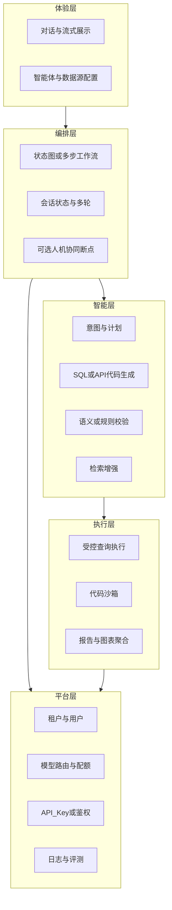

# 智能数据分析 Agent 产品蓝图（自建参考）

本文从 **产品视角** 抽象 DataAgent 类系统：你要解决谁的问题、拆成哪些能力模块、如何分阶段交付。技术栈不必与本仓库一致（也可用 LangGraph、自主编排引擎等），但 **能力分层与数据流** 可对照复用。

**关联阅读**：[DataAgent 上手与 AI Agent 学习指南](./DATAAGENT_ONBOARDING_AND_LEARNING.md)（架构、源码锚点、分阶段学习计划）。

---

## 1. 用户价值与场景边界

| 维度 | 建议想清楚的内容 |
|------|------------------|
| **目标用户** | 业务分析师、运营、管理层自助问数；还是开发者/数据团队对内工具？ |
| **核心任务（JTBD）** | 「用自然语言拿到可信的数据结论与图表」，而非单次 SQL 字符串。 |
| **场景边界** | 只读分析 vs 允许写库；是否必须支持多数据源、跨库；是否需要导出/订阅报告。 |
| **成功标准** | 准确率（SQL/口径）、可解释性、耗时、人工介入比例、审计留痕。 |

DataAgent 的选择是：**复杂分析走多步图编排 + 可选人工审计划 + RAG 补业务知识 + 沙箱执行 Python + 流式反馈**。你的产品可以先做「NL2SQL + 结果表」，再逐步加规划、Python、报告、人机门。

---

## 2. 产品能力分层（与 DataAgent 对照）

把这些当成 **产品模块**，每个模块对应一类研发工作与运维成本：

| 产品模块 | DataAgent 中的落点（见 [上手文档](./DATAAGENT_ONBOARDING_AND_LEARNING.md) 第 3～4 节） | 自建时的最小实现思路 |
|----------|-------------------------------|----------------------|
| 体验层 | 前端 + `GraphController` SSE | Web 对话页 + SSE/WebSocket；管理台存 Agent/数据源/知识 |
| 编排层 | `StateGraph`、`GraphServiceImpl`、`interrupt` | 选一种图引擎；统一 `state` 结构；需要审计划则做「暂停-恢复」 |
| 智能层 | `workflow/node`、RAG、混合检索 | 意图分类 → 计划（可 JSON）→ 生成 → **校验-重试环** |
| 执行层 | `SqlExecuteNode`、`service/code/`、报告节点 | 只读账号、行数/耗时上限；Python 用容器或 WASM 沙箱 |
| 平台层 | MyBatis 管理库、`AiModelRegistry`、MCP/API Key | 多租户隔离；密钥与模型配置外置；对接 Langfuse/自研追踪 |

---

## 3. MVP 与迭代路线（产品路线，非仅技术）

1. **MVP（1～2 个迭代）**：单数据源、NL2SQL、结果表格展示、基础权限（库表白名单）、同步或简单流式输出。  
2. **增强可信度**：语义/规则校验、错误自愈重试、SQL 审计日志；可选 **RAG**（术语表、指标口径文档）。  
3. **复杂分析**：引入 **Planner**（多步：过滤 → 聚合 → 对比）；**Python 沙箱** 做统计与预测；**报告**（Markdown/HTML + 图表）。  
4. **企业特性**：**Human-in-the-loop**（审计划）、多模型路由、API Key、**MCP** 接入外部生态、观测与评测数据集。

每一步都应有 **可演示的 Demo 与度量**（例如：基准问题集上的首次执行成功率），避免堆功能却不可控。

---

## 4. 差异化可从哪些切口做

- **垂直行业**：预置指标体系、监管口径、常用模版计划。  
- **数据侧**：更强的 schema 血缘、自动敏感列脱敏、行级权限（超出通用实现时需单独设计）。  
- **协作**：报告共享、评论批注、计划版本对比。  
- **集成**：钉钉/企微机器人、BI 工具深度集成，而不仅是网页。

---

## 5. 风险与合规（产品必须预留）

- **注入与安全**：自然语言 → SQL/API 是高风险路径；限流、参数化、禁止多语句、表级白名单。  
- **沙箱**：任意代码执行必须隔离资源（CPU、内存、网络、超时）。  
- **隐私**：日志中是否存原始行数据；Embedding 与向量库中的合规要求。  
- **责任界定**：明显错误结论时的免责声明与「人工复核」提示（与 HITL 策略一致）。

---

## 6. 自学用「对照表」：读完 DataAgent 后自建时做什么

| 你在 DataAgent 里学到的 | 自建产品时你可以… |
|------------------------|-------------------|
| `StateGraph` + dispatcher | 用相同模式或换 LangGraph/自研 DAG，保留「状态 + 条件边」 |
| SSE 推节点事件 | 保留流式 UX，方便调试与建立用户信任 |
| Planner + SQL 校验环 | 产品核心：**计划可解释 + 执行可校验** |
| RAG + hybrid | 把「业务语言」对齐到「库表字段」，降低幻觉 |
| MCP | 把智能体能力变成可被其他 AI 客户端调用的「工具服务」 |

完成主文档中的 **[分阶段学习计划](./DATAAGENT_ONBOARDING_AND_LEARNING.md)**（第 6 节）后，建议用一页纸写清：**人物画像、三条主路径（MVP/增强/企业）、模块表、第一条迭代范围**，再动手搭仓库——产品与架构会对齐，避免复制代码却不知为何如此设计。
